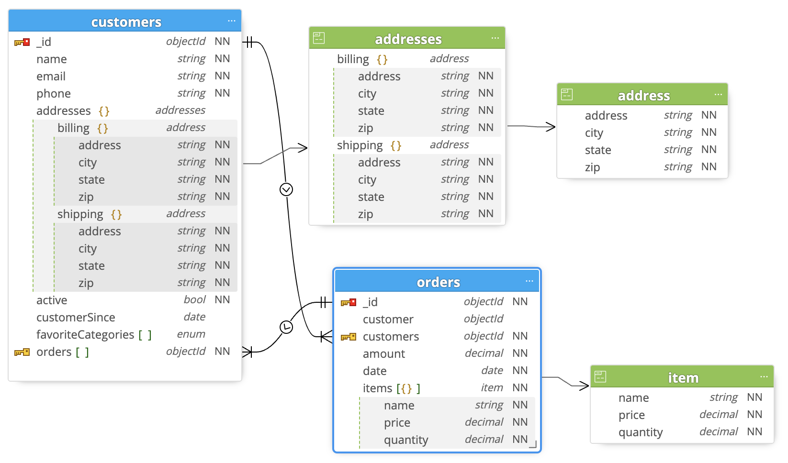

# Challenge 1-1 - Database Schema

Create a database schema using JSON Schema for 2 collections, customers and orders, with the following property types (required properties in bold)

## Customers Collection

- **name** (string)
- **phone** (string)
- **email** (string) - Unique Index
- **active** (bool)
- **customerSince** (date)
- favoriteCategories (array of strings (enum))
  - Note: Set 3 values for the enum such as "food", "clothing", "sports"
- addresses (obj)
  - billing (obj)
    - **address** (string)
    - **city** (string)
    - **state** (string)
    - **zip** (string)
  - shipping (obj)
    - **address** (string)
    - **city** (string)
    - **state** (string)
    - **zip** (string)
- **orders** (array of ObjectIds)

## Orders Collection

- **customer** (objectId)
- **date** (date)
- **amount** (decimal)
- **items** (array of obj)
  - **name** (string)
  - **amount** (decimal)
  - **quantity** (decimal)

## Solution

<details>
<summary>Click to view</summary>



```javascript
db.createCollection('customers', {
  validator: {
    $jsonSchema: {
      bsonType: 'object',
      title: 'customers',
      required: ['name', 'email', 'phone', 'active', 'orders'],
      properties: {
        name: {
          bsonType: 'string'
        },
        email: {
          bsonType: 'string'
        },
        phone: {
          bsonType: 'string'
        },
        addresses: {
          bsonType: 'object',
          title: 'addresses',
          properties: {
            billing: {
              bsonType: 'object',
              title: 'address',
              required: ['address', 'city', 'state', 'zip'],
              properties: {
                address: {
                  bsonType: 'string'
                },
                city: {
                  bsonType: 'string'
                },
                state: {
                  bsonType: 'string'
                },
                zip: {
                  bsonType: 'string'
                }
              }
            },
            shipping: {
              bsonType: 'object',
              title: 'address',
              required: ['address', 'city', 'state', 'zip'],
              properties: {
                address: {
                  bsonType: 'string'
                },
                city: {
                  bsonType: 'string'
                },
                state: {
                  bsonType: 'string'
                },
                zip: {
                  bsonType: 'string'
                }
              }
            }
          }
        },
        active: {
          bsonType: 'bool'
        },
        customerSince: {
          bsonType: 'date'
        },
        favoriteCategories: {
          bsonType: 'array',
          items: {
            enum: ["clothing", "sports", "food"]
          }
        },
        orders: {
          bsonType: 'array',
          items: {
            bsonType: 'objectId'
          }
        }
      }
    }
  }
});
db.customers.createIndex({
  "email": 1
}, {
  name: "customers_ix_1",
  unique: true
})
db.createCollection('orders', {
  validator: {
    $jsonSchema: {
      bsonType: 'object',
      title: 'orders',
      required: ['customer', 'amount', 'date', 'items'],
      properties: {
        customer: {
          bsonType: 'objectId'
        },
        amount: {
          bsonType: 'decimal'
        },
        date: {
          bsonType: 'date'
        },
        items: {
          bsonType: 'array',
          items: {
            title: 'item',
            required: ['name', 'price', 'quantity'],
            properties: {
              name: {
                bsonType: 'string'
              },
              price: {
                bsonType: 'decimal'
              },
              quantity: {
                bsonType: 'decimal'
              }
            }
          }
        }
      }
    }
  }
});

```

</details>
